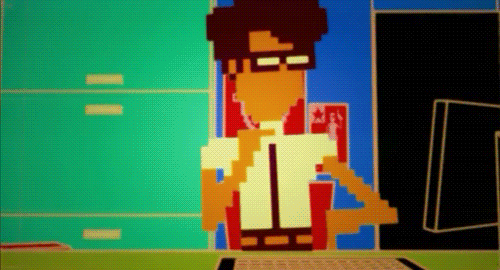

    
    <h1 align="center">Hi 👋, I'm Augusto Abad</h1>
    <h3 align="center">Engineer and Data Scientist</h3>

 

 

- 🔭 I’m currently working on **on grow professionally**

- 🌱 I’m currently learning **to consolidate, strengthen and expand my knowledge of Data Science**

- 👯 I’m looking to collaborate on **a challenging and motivating data science project**

- 💬 Ask me about **Python, Data Analitycs and Machine Learning**

- 📫 How to reach me **augusto.abad@outlook.com**

 

<h3 align="left">Connect with me:</h3>

<h3 align="left">Languages and Tools:</h3>
<a href="https://www.python.org" target="_blank" rel="noreferrer"> 

      </a>   

